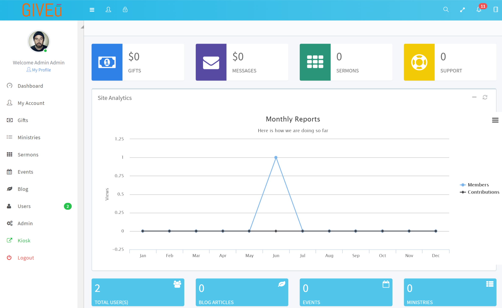

<h1>Church Content Management System</h1>

This is a church content management with online giving system build on Lavarel Framework. Please see attached installation guide.

or open a ticket https://amdtllc.com/support.

> **Note:**
> We aim to provide this application for free and provision a marketplace for developers to create their themes and plugins that can be added to the platform.

##Requirements

* PHP >= 7.1
* SSH access
* MySQL database
* composer
* NPM

##Installation

See instructions at https://gitlab.com/jgmuchiri/church-cms/wikis/Installation

## Contributions to the project are welcome
